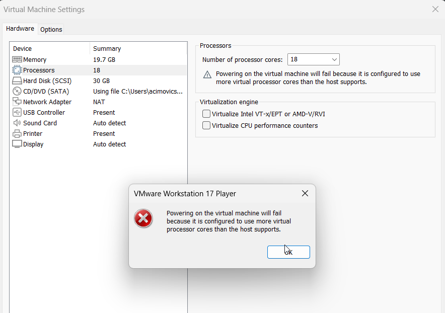

KN01

## Weniger RAM / Prozessoren als Host-System Screenshot

## Zuviel RAM / Prozessoren als Host-System Screenshot Fehlermeldung

## Warum gibt es solche Fehlermeldungen?

VMware Workstation Player 17 verwendet eine Technologie namens "Virtualisierung", um mehrere Betriebssysteme auf einem einzelnen Host-System auszuführen. Die Ressourcen, wie RAM und Prozessoren, werden zwischen dem Host-System und den virtuellen Maschinen aufgeteilt. Das Host-System stellt die physischen Ressourcen bereit, die von den virtuellen Maschinen gemeinsam genutzt werden.

Die Menge an RAM und Prozessoren, die du den virtuellen Maschinen zuweisen kannst, ist begrenzt durch die verfügbaren physischen Ressourcen des Host-Systems. Wenn du mehr RAM oder Prozessoren den virtuellen Maschinen zuweisen möchtest, als das Host-System unterstützt, könnten die Ressourcen überbeansprucht werden. Dies könnte zu Leistungsproblemen auf dem Host-System und den virtuellen Maschinen führen.

Um sicherzustellen, dass alle virtuellen Maschinen und das Host-System reibungslos funktionieren, ist es wichtig, die Ressourcenzuweisungen vernünftig und im Einklang mit den Kapazitäten des Host-Systems zu halten. Das Betriebssystem des Hosts überwacht die Ressourcennutzung und versucht, eine ausgewogene Verteilung sicherzustellen, um eine optimale Leistung zu gewährleisten. Daher ist es nicht möglich, mehr Ressourcen den virtuellen Maschinen zuzuweisen, als das Host-System physisch bereitstellen kann.