KN02

# EC2

### HTML Seite, inkl. URL

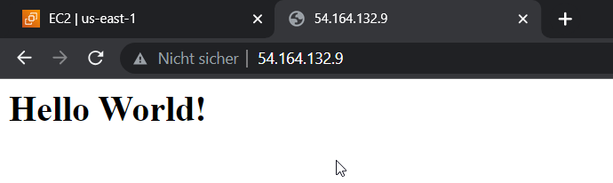

### Liste EC2 Instanzen

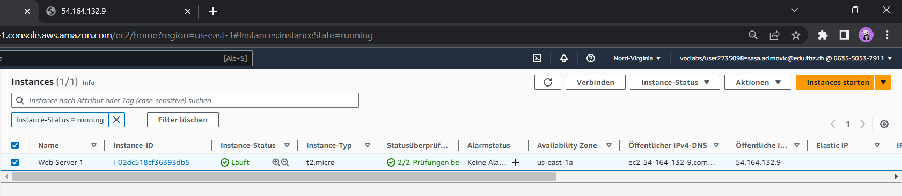

### Details Web Server Instanz

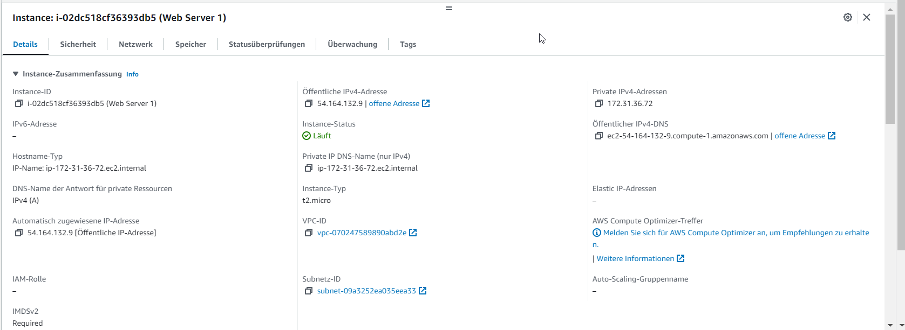

### Security-Group Liste Regeln

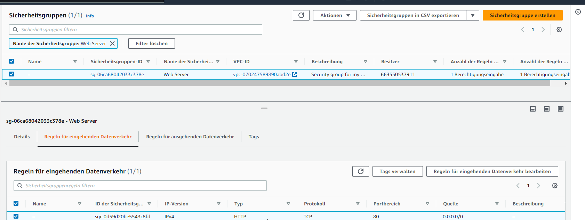

# S3

### Liste Buckets

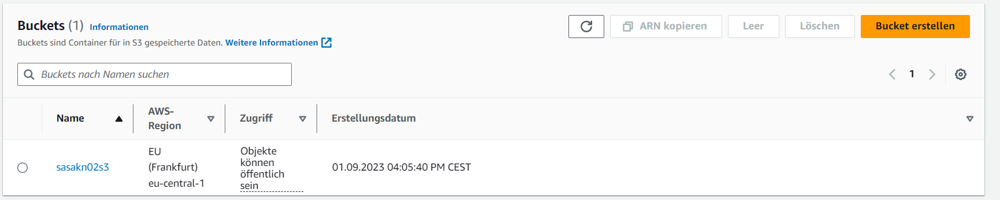

### HTML Seite, inkl. URL

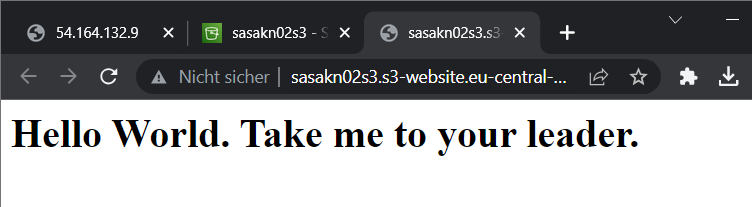

### Liste Dateien im Bucket

### Eigenschaften von "Static website hosting"

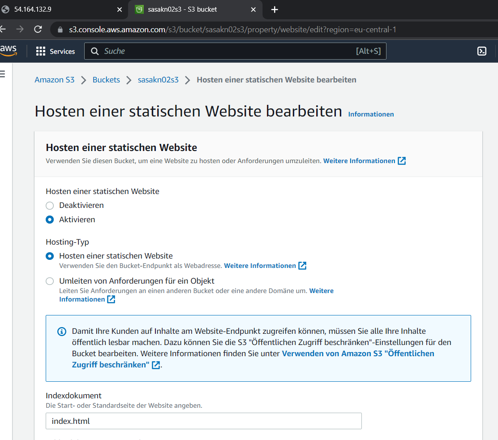

# Aufgabe B)

### SSH Befehl Schlüssel 1.

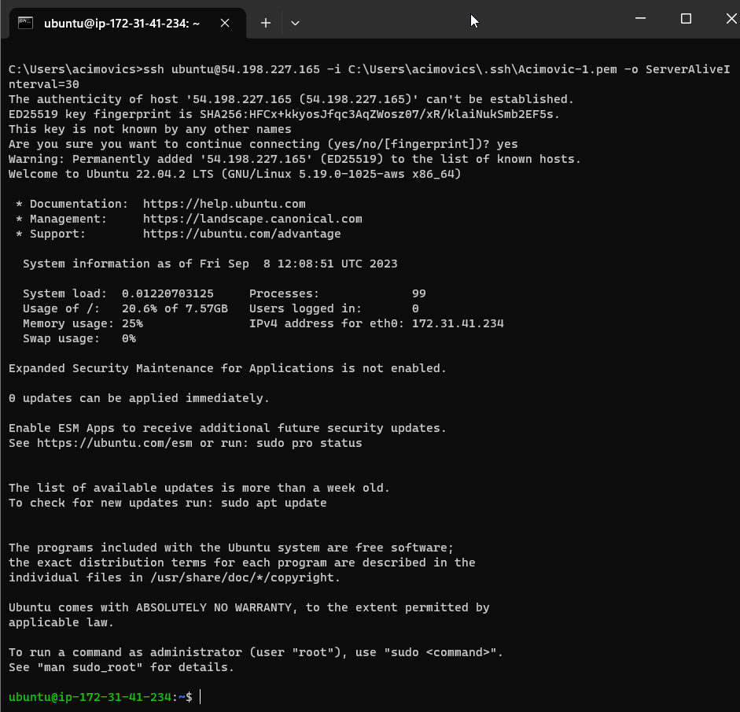

### SSH Befehl Schlüssel 2.

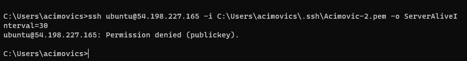

### Screenshot Instanz-Detail (Mit Schlüssel)

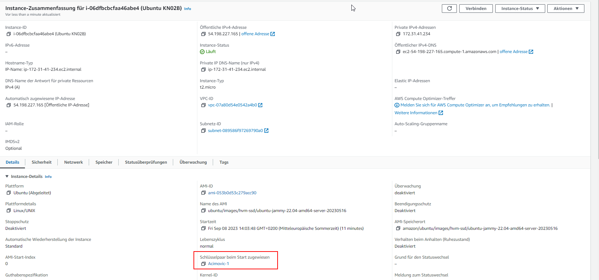

# Aufgabe C)

### index.html Webseite Screenshot

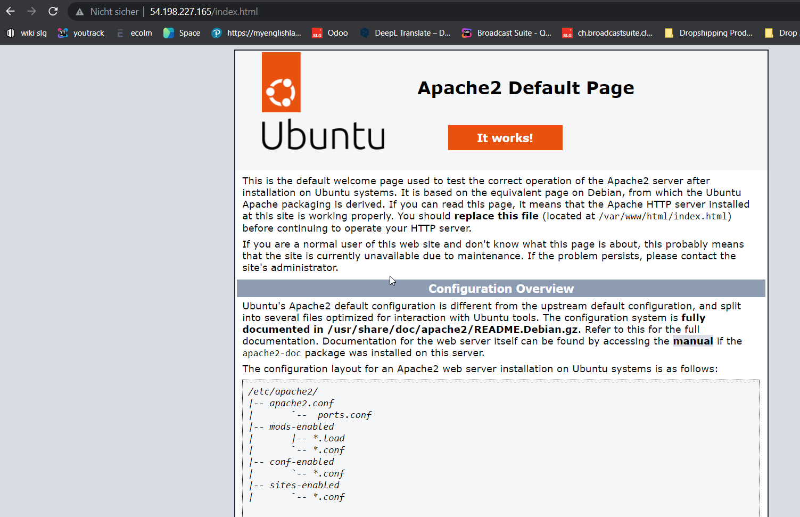

### info.php Webseite Screenshot

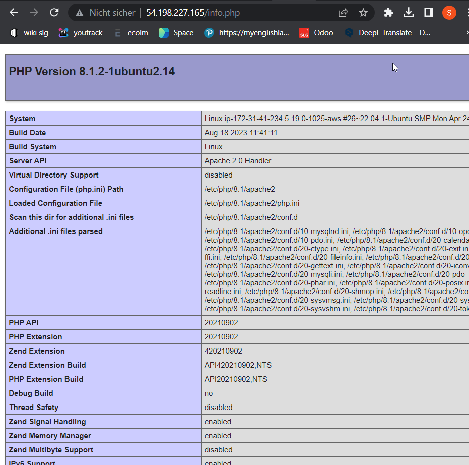

### db.php Webseite Screenshot

