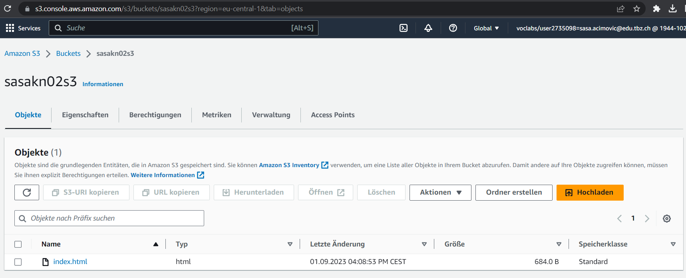
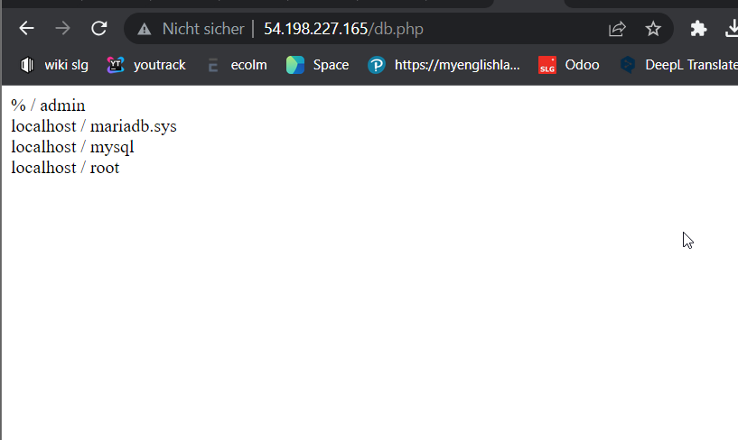

KN02

# EC2

### HTML Seite, inkl. URL

### Liste EC2 Instanzen

### Details Web Server Instanz

### Security-Group Liste Regeln

# S3

### Liste Buckets

### HTML Seite, inkl. URL

### Liste Dateien im Bucket

### Eigenschaften von "Static website hosting"

# Aufgabe B)

### SSH Befehl Schlüssel 1.

### SSH Befehl Schlüssel 2.

### Screenshot Instanz-Detail (Mit Schlüssel)

# Aufgabe C)

### index.html Webseite Screenshot

### info.php Webseite Screenshot

### db.php Webseite Screenshot

