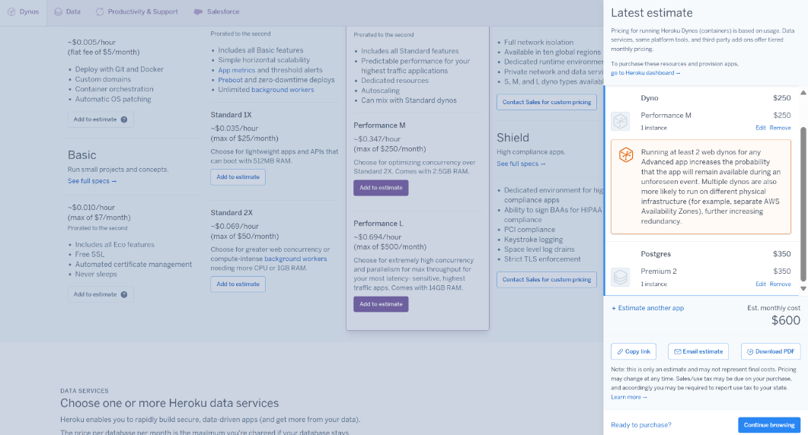

# M346

## KN_07

**A)**

**AWS und Azure**
1. 

Ich habe 1 Web Server mit 1 Core, 20GB Speicher, 2 GB RAM, Ubuntu Pro ausgewählt. Den rest habe ich auf Default gelassen. Bei Load Balancing habe ich "Load Balancer on Outposts" ausgewählt. Bei Backup habe ich einmal täglich für die letzten 7 Tage, Wöchentlich für den letzten Monat und Monatlich für die letzten drei Monate. 

Ich habe einen Web Server mit 1 Core, 20GB SPeicher 2GB RAM und Ubuntu Pro als Betriebssystem gewählt, den Rest habe ich gelassen. 
Beim Load Balancing ist das das "Load Balancer on Outposts" an.
Bei Backup habe ich täglich für die letzten 7 Tage, Wöchentlich für den letzten Monat und Monatlich für die letzten drei Monate.

Fast genau das gleiche aber für einen DB Server. 1 DB Server mit 2 Cores, 100GB Speicher, 4 GB RAM, Ubuntu
 

Bei Azure war es das gleiche Prinzip.

 

**Heroku**
2. 

3. 

**Zoho CRM und SalesForce**

Für ein mittelgrosses Unternehmen mit etwa über 10 Köpfen ist Zoho CRM geeignet weil es kosteneffizient ist, lässt sich einfach implementieren und ist Benutzerfreundlich.

Salesforce Sales Cloud ist extrem skalierbar und kann mit dem Wachstum Ihres Unternehmens mithalten. Es bietet eine breite Palette von Funktionen und Integrationen, die für grössere Unternehmen geeignet sind.

**SaaS**
 Keine Hardware, Implementierung einfach gemacht, weniger Wartungsaufwand, einfache Nutzung

**PaaS**
Entwicklungsplattformen für die Anwendungsentwicklung, automatisierte Skalierung und Verwaltung.

**IaaS**
Skalierbar, volle Kontrolle über die Infrastruktur, Umgebung flexibel.

**Gegenüberstellung**
Wenn nur CRM benötigt wird, wäre SaaS zu 99% die beste Option da diese nicht nur eine praktische Lösung ist sondern auch eine kosteneffiziente Lösung. Alles andere wäre zu übertrieben.

**B)**

**1. Wie stark unterscheiden sich die Angebote?**
Im Vergleich zu Zoho CRM bietet Salesforce Sales Cloud mehr Funktionen und overall Integrationen.

Salesforce Sales Cloud ist besser skalierbar.

Jedoch ist Zoho CRM billiger als Salesforce Sales Cloud, macht ja auch Sinn.

**2. Welches ist das billigste?**
In der Regel ist Zoho CRM billiger als Salesforce Sales Cloud, aber es hängt von den verschiedenen Faktoren ab, einschliesslich der Anzahl der Benutzer, der benötigten Funktionen.
Zoho CRM ist eigentlich billiger aber kommt ja immer darauf an, welche Add-Ons man nimmt usw., wieviel Nutzer gibt es? Extra Funktionen?

**3. Wieso ist eines davon viel teurer? Ist es aber wirklich teurer?**

Die höheren Kosten von Salesforce können Sinn machen, wenn Sie die erweiterten Funktionen, die Skalierbarkeit und die Integrationen benötigen, die es bietet.
